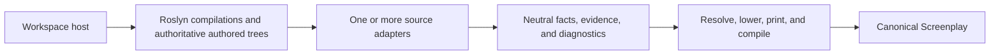

Build a source adapter when you need to recover a framework's authored .NET semantics into a verified Screenplay model.

A source adapter owns **framework interpretation**. It does not load an MSBuild workspace, start the analyzed application, inspect live infrastructure, construct Screenplay syntax, or print `.play` text.



## Choose the packages

| Package | Use it for |
| --- | --- |
| `Cratis.Screenplay.Generation.Contracts` | Framework-neutral facts, identities, evidence, and diagnostics |
| `Cratis.Screenplay.Generation` | Resolution, lowering, canonical printing, and compiler verification |
| `Cratis.Screenplay.Generation.DotNet` | Roslyn analysis, source evidence, type shapes, concepts, and source placement |
| `Cratis.Screenplay.Generation.DotNet.Vogen` | Optional Vogen source adapter composed by a host; ecosystem adapters do not need it unless they own that composition |

Only these four Generation packages release in lockstep. Ecosystem adapters and hosts have independent versions.

| Project role | Typical references |
| --- | --- |
| Adapter library | Contracts + DotNet |
| Composition host | Generation + every explicitly selected adapter |
| Adapter specs | Adapter library + Roslyn CSharp + specification packages |
| Analyzed application | Its own framework packages only; it does not reference Generation |

Keep runtime packages for the framework you analyze out of the adapter whenever Roslyn metadata names can express the contract. This avoids loading one framework version into a host that analyzes another version.

Reference one version across all directly referenced Screenplay Generation packages.

:::note
`v0.10.1` is the current public release. `DotNetConceptFacts`, `DotNetInvocations`, the newest `DotNetSymbols` helpers, source placement, and method identities described below are on current `main` and require the next lockstep minor release. New adapters that need these APIs should wait for that release instead of copying them.
:::

| Capability | Released `0.10.1` | Current `main` |
| --- | ---: | ---: |
| Adapter, context, and fact contracts | Yes | Yes |
| Stable source identity | Yes | Yes |
| Executable specification facts | Yes | Yes |
| `DotNetConceptFacts` | No | Yes |
| New symbol and invocation helpers | No | Yes |
| Fixed source snapshots and placement | No | Yes |
| Overload-safe method subjects | No | Yes |

Sections using a current-main-only API prepare you for the next minor release; they are not instructions for a `0.10.1` package consumer.

## Implement the adapter contract

Implement `IDotNetScreenplayAdapter`:

```csharp
using Cratis.Screenplay.Generation;
using Cratis.Screenplay.Generation.DotNet;
using Microsoft.CodeAnalysis;

namespace Acme.Screenplay;

public sealed class AcmeScreenplayAdapter : IDotNetScreenplayAdapter
{
    static readonly AdapterIdentity _identity = new()
    {
        Id = "acme",
        Version = "1.0.0"
    };

    public AdapterIdentity Identity => _identity;

    public bool CanAnalyze(DotNetAnalysisContext context) =>
        context.Projects.Any(project =>
            project.Compilation.GetTypeByMetadataName("Acme.CommandAttribute") is not null);

    public AdapterContribution Analyze(
        DotNetAnalysisContext context,
        DotNetAdapterOptions options)
    {
        var facts = new List<GenerationFact>();
        var diagnostics = new List<GenerationDiagnostic>();

        foreach (var project in context.Projects)
        {
            foreach (var type in new DotNetArtifactCatalog(project.Compilation).Types)
            {
                var commandAttribute = DotNetSource
                    .AuthoredAttributesOf(type, project.AuthoredSyntaxTrees)
                    .FirstOrDefault(attribute =>
                        attribute.AttributeClass is not null &&
                        DotNetSubjectIds.MetadataName(attribute.AttributeClass) == "Acme.CommandAttribute");
                if (commandAttribute is null)
                {
                    continue;
                }

                var subject = project.SubjectForType(type);
                var evidence = DotNetSource.EvidenceFor(
                    commandAttribute,
                    Identity,
                    project,
                    EvidenceStrength.Exact,
                    "The authored type has Acme.CommandAttribute");
                var key = new ArtifactKey
                {
                    Subject = subject,
                    Kind = ArtifactKind.Command
                };

                facts.Add(new ArtifactFact
                {
                    Id = new FactId { Value = $"acme:command:{subject.Value}" },
                    Subject = subject,
                    Definition = new ArtifactDefinition
                    {
                        Key = key,
                        Name = type.Name,
                        File = evidence.Source?.Path,
                        Properties = DotNetTypeShapes.PropertiesOf(type, context)
                    },
                    Evidence = evidence
                });
                facts.Add(new ArtifactPlacementFact
                {
                    Id = new FactId { Value = $"acme:placement:command:{subject.Value}" },
                    Subject = subject,
                    Artifact = key,
                    Placement = new ArtifactPlacement
                    {
                        Module = options.Module ?? project.Name,
                        Slice = type.Name,
                        SliceKind = GenerationSliceKind.StateChange
                    },
                    Evidence = evidence with
                    {
                        Strength = EvidenceStrength.Heuristic,
                        Explanation = "The adapter's explicit module and command name provide the initial placement"
                    }
                });
            }
        }

        return new AdapterContribution
        {
            Adapter = Identity,
            Facts = facts,
            Diagnostics = diagnostics
        };
    }
}
```

Keep `CanAnalyze()` cheap, deterministic, and semantic. Package presence alone must not create facts. Return only the facts and diagnostics the adapter can establish from `Analyze()`.

## Establish the analysis context in the host

The workspace host owns project loading and source authority. `Cratis.Screenplay.Generation.DotNet` deliberately does not reference `MSBuildWorkspace`; an MSBuild host additionally references `Microsoft.CodeAnalysis.Workspaces.MSBuild` and `Microsoft.Build.Locator`.

For each project, supply a `DotNetProjectCompilation` with:

- a stable logical `Name`;
- the Roslyn `Compilation`;
- the exact `AuthoredSyntaxTrees` captured from project documents;
- an optional `DotNetProjectSourceContext` for stable source identity and display paths;
- `DotNetProjectRole.Application` or `DotNetProjectRole.Specifications`;
- optional compatibility values such as `ProjectPath` and `SourceRoot`.

A minimal trusted host looks like this:

```csharp
using Cratis.Screenplay.Generation.DotNet;
using Microsoft.Build.Locator;
using Microsoft.CodeAnalysis;
using Microsoft.CodeAnalysis.MSBuild;

MSBuildLocator.RegisterDefaults();
using var workspace = MSBuildWorkspace.Create();
var workspaceFailures = new List<string>();
workspace.WorkspaceFailed += (_, args) => workspaceFailures.Add(args.Diagnostic.Message);
var projectPath = Path.GetFullPath("Source/Application/Application.csproj");
var workspaceRoot = Path.GetFullPath(".");
var loadedProject = await workspace.OpenProjectAsync(projectPath);
var projectDirectory = Path.GetDirectoryName(projectPath)!;
var authoredTrees = new HashSet<SyntaxTree>();
var sourceDocuments = new List<DotNetSourceDocument>();

foreach (var document in loadedProject.Documents.OrderBy(_ => _.FilePath, StringComparer.Ordinal))
{
    if (document.FilePath is null || await document.GetSyntaxTreeAsync() is not { } tree)
    {
        continue;
    }

    authoredTrees.Add(tree);
    sourceDocuments.Add(new DotNetSourceDocument
    {
        SyntaxTree = tree,
        ProjectRelativePath = Path.GetRelativePath(projectDirectory, document.FilePath),
        WorkspaceRelativePath = Path.GetRelativePath(workspaceRoot, document.FilePath)
    });
}

var compilation = await loadedProject.GetCompilationAsync() ??
                  throw new InvalidOperationException("The project did not produce a compilation");
var compilationErrors = compilation.GetDiagnostics()
    .Where(_ => _.Severity == DiagnosticSeverity.Error)
    .ToArray();
if (workspaceFailures.Count > 0 || compilationErrors.Length > 0)
{
    throw new InvalidOperationException(string.Join(
        Environment.NewLine,
        workspaceFailures.Concat(compilationErrors.Select(_ => _.ToString()))));
}

var sourceContext = DotNetSourcePaths.Create(
    "Source/Application/Application",
    new DotNetSourcePathPolicy
    {
        Version = 1,
        DisplayRoot = DotNetSourceDisplayRoot.Workspace,
        CasePolicy = DotNetSourcePathCasePolicy.Ordinal
    },
    sourceDocuments);
var project = new DotNetProjectCompilation
{
    Name = loadedProject.Name,
    Role = DotNetProjectRole.Application,
    ProjectPath = projectPath,
    SourceContext = sourceContext,
    Compilation = compilation,
    AuthoredSyntaxTrees = authoredTrees
};
var context = new DotNetAnalysisContext([project]);
```

Capture authored trees from `Project.Documents`. Generated filenames and headers are useful corroboration, but they are not source authority. Assign `DotNetProjectRole.Specifications` to specification projects instead of inferring that role from their name.

Use `DotNetSourcePaths.Create(...)` to map project documents into a stable source context. Physical checkout roots must not become identities. Prefer `DotNetSource.EvidenceFor(..., project, ...)` and `DotNetSource.RangeForProject(...)` over the legacy `SourceRoot` overloads.

## Use shared Roslyn mechanics

Prefer semantic helpers over adapter-specific syntax utilities:

- `DotNetArtifactCatalog` provides canonical source type discovery;
- `DotNetTypeShapes` converts public properties and exact type subjects;
- `DotNetSymbols` handles metadata-name attributes and interfaces, collection elements, named arguments, and companion method families;
- `DotNetInvocations` resolves exact direct and reduced methods, formal-parameter arguments, and bounded receiver roots;
- `DotNetSource` establishes authored declarations, attributes, evidence, and ranges.

`DotNetInvocations.MethodFor(...)` returns `null` when Roslyn has no exact symbol. Do not use candidate symbols to guess through a broken compilation. Use `DefinitionOf(...)` before matching generic extension metadata, `ArgumentForParameter(...)` instead of positional assumptions, and `ReceiverRootParameter(...)` only for a bounded direct parameter-root check.

Adapter discovery depends on compiler symbols and semantic models, not preferred source formatting. Keep one reusable source fixture with semantically valid generated, decompiler-style, fully qualified, explicitly cast, and otherwise non-idiomatic C#. Its supported facts must resolve without extra loss.

## Use stable identities

Three identities serve different purposes:

- `AdapterIdentity` identifies the adapter implementation and version.
- `SubjectId` identifies the source entity that facts describe.
- `FactId` identifies one semantic assertion.

Use project-qualified identities:

```csharp
var typeSubject = project.SubjectForType(type);
var methodSubject = project.SubjectForMethod(method);
```

`SubjectForMethod()` uses a .NET documentation identity so overloads, generic arity, arrays, and parameter modifiers do not collide. Use `DotNetSubjectIds.MethodDisplayName(method)` for readable diagnostics; never use a short method name as identity.

Fact IDs must be globally stable and unique. Prefix them with the adapter and semantic role, and add a discriminator when one source member can produce several same-kind assertions.

## Contribute neutral facts

Use the smallest fact vocabulary that says what the source proves:

- `ArtifactFact` — a command, event, read model, projection, reaction, message, handler, concept, or another supported role;
- `ArtifactPlacementFact` — module, feature, slice, and independently established slice kind;
- `RelationshipFact` — handles, reads, produces, consumes, builds, returns, cascades, publishes, starts or appends streams, or document persistence;
- concept representation, attribute, and validation facts;
- specification scenario, step, and typed value facts.

Do not overload a nearby role. A published message is not a persisted event. A document is not an event-built read model unless source evidence proves the projection. A response is not a cascade.

Use `TypeReferenceDefinition.Subject` when a property targets an exact discovered type or concept. `DotNetTypeShapes.PropertiesOf(type, context)` and `TypeReferenceFor(type, context)` preserve project-qualified type subjects.

## Nominate declared concepts

When a framework explicitly declares a wrapper as a domain value through an authored attribute or registration API, use:

```csharp
var facts = DotNetConceptFacts.Emit(
    wrapper,
    backing,
    project.SubjectForType(wrapper),
    conceptEvidence,
    representationEvidence);
```

Do not infer concepts from names such as `Id`, from having one property, or from an arbitrary record-struct shape. If the framework nominates the concept but does not prove its primitive backing, retain the concept artifact and emit an adapter-owned `Unsupported` diagnostic instead of inventing a representation.

## Derive source placement

Source layout does not decide semantic role. First establish `ArtifactKind` and `GenerationSliceKind` from framework semantics. Then use the shared placement pipeline:

1. Create a fixed snapshot with `DotNetSourceStructures.Create(context)`.
2. Find the source structure for the artifact subject.
3. Build a `DotNetSourcePlacementRequest` with the artifact key, structure, slice kind, and `options.SourceStructurePolicy`.
4. Call `DotNetSourcePlacementDerivation.Derive(...)` once for the complete request set.
5. Convert successful placements to `ArtifactPlacementFact` values and retain every placement diagnostic.

```csharp
var structureSnapshot = DotNetSourceStructures.Create(context);
diagnostics.AddRange(structureSnapshot.Diagnostics);
var structures = structureSnapshot.Structures.ToDictionary(_ => _.Subject);
var placementRequests = new List<DotNetSourcePlacementRequest>();
foreach (var artifact in facts.OfType<ArtifactFact>())
{
    if (!structures.TryGetValue(artifact.Subject, out var structure))
    {
        diagnostics.Add(new GenerationDiagnostic
        {
            Code = "ACME0001",
            Severity = GenerationDiagnosticSeverity.Error,
            Outcome = GenerationDiagnosticOutcome.Unknown,
            Message = $"Authored source structure for '{artifact.Definition.Name}' is unavailable",
            Source = artifact.Evidence.Source,
            Subject = artifact.Subject
        });
        continue;
    }

    placementRequests.Add(new DotNetSourcePlacementRequest
    {
        Artifact = artifact.Definition.Key,
        Structure = structure,
        SliceKind = GenerationSliceKind.StateChange,
        Policy = options.SourceStructurePolicy
    });
}

var placementSnapshot = DotNetSourcePlacementDerivation.Derive(placementRequests);
diagnostics.AddRange(placementSnapshot.Diagnostics);
foreach (var placement in placementSnapshot.Placements)
{
    var artifact = facts.OfType<ArtifactFact>().Single(_ =>
        _.Definition.Key == placement.Artifact);
    facts.Add(new ArtifactPlacementFact
    {
        Id = new FactId { Value = $"acme:placement:{placement.Artifact.Kind}:{placement.Artifact.Subject.Value}" },
        Subject = placement.Artifact.Subject,
        Artifact = placement.Artifact,
        Placement = placement.Placement,
        Evidence = artifact.Evidence with
        {
            Strength = EvidenceStrength.Heuristic,
            Explanation = "Host-owned source structure provides the default Screenplay placement"
        }
    });
}
```

An adapter with several behavior kinds supplies the independently proven `GenerationSliceKind` for each artifact instead of assigning `StateChange` universally. Snapshot diagnostics and derivation diagnostics both belong in the adapter contribution.

The host owns `FeatureRoot`, explicit module, and skipped namespace segments. Folder and namespace evidence must agree when both establish placement.

## Assign evidence strength deliberately

| Strength | Meaning |
| --- | --- |
| `Exact` | A bound invocation, attribute, interface, override, or return type directly proves the fact |
| `Configured` | Authored framework configuration proves the fact |
| `Conventional` | A documented framework convention applies after exact admission |
| `Heuristic` | Naming or structure suggests display or placement only |

A heuristic must never establish persisted events, stream ownership, authorization, or another correctness-critical role.

## Report loss instead of guessing

Each adapter owns a stable diagnostic-code range. Include these values in each diagnostic:

- a stable code;
- severity;
- an `Unknown`, `Conflict`, or `Unsupported` outcome when applicable;
- a precise message;
- a source range when authored source establishes the loss;
- the affected subject.

Use `Unknown` when source cannot establish the answer, `Conflict` when exact assertions disagree, and `Unsupported` when the behavior is known but cannot be represented. Never reuse a published code for a different condition.

When an authored framework extension can alter discovery or runtime conventions beyond what the adapter can prove statically, use a stable adapter-owned code and `GenerationDiagnosticOutcome.Unsupported`. Set `Subject` to the authored extension type. Name both the exact hook surface and affected convention scope:

```text
Authored extension '<type>' uses '<hook surface>' and may alter <scope>; the recovered model reflects default <scope> only.
```

This reports bounded default recovery without treating the entire framework as unrecognized. Do not interpret arbitrary policy bodies.

A host must always display every diagnostic, even when `IsSuccess` is `true`. Errors block publication. Hosts choose whether warnings block adoption, but they must not hide them. Information diagnostics describe known bounded loss.

Tests must assert required artifacts and relationships directly from `Graph` or `Source`; `IsSuccess` alone proves only that no error diagnostic was produced.

## Compose and verify once

A host runs each admitted adapter once, keeps contributions separate, and invokes one generator:

```csharp
var contributions = adapters
    .Where(adapter => adapter.CanAnalyze(context))
    .Select(adapter => adapter.Analyze(context, options));

var result = new ScreenplayDefinitionGenerator().Generate(
    contributions,
    new ScreenplayGenerationOptions { Domain = "Ordering" });
```

`GeneratedScreenplayDefinition` contains canonical source, syntax, the resolved graph, and all diagnostics. `IsSuccess` means there are no error diagnostics; warnings may still describe semantic loss.

Adapters never call the resolver, lowerer, printer, or compiler themselves. Generation does not discover adapter packages automatically. Direct hosts construct the `IDotNetScreenplayAdapter[]`; package or provider discovery and admission remain host-specific.

Adopt a newly required API in this order:

1. release Screenplay Generation;
2. upgrade and release the ecosystem adapter;
3. upgrade the composition host.

## Test the adapter

Every adapter should prove:

1. exact positive discovery;
2. close lookalikes do not match;
3. generated-only declarations cannot originate facts;
4. unknown or ambiguous source fails closed;
5. overload and same-name identities remain distinct;
6. reversed project, adapter, fact, and syntax-tree order is byte-identical;
7. relocated checkouts preserve stable identities;
8. non-idiomatic but semantically equivalent source yields equivalent facts;
9. incompatible assertions remain visible conflicts;
10. diagnostic codes, outcomes, subjects, and locations are stable;
11. generated Screenplay compiles and survives print, compile, and print unchanged;
12. package consumers compile against the candidate package set.

Use public, pinned framework samples for package-level compatibility. Keep focused authored-source fixtures purpose-built and independent of private product source.

Start with one positive `Specification` that creates a `CSharpCompilation`, establishes its authored trees, invokes the adapter, resolves the contribution, and asserts the exact artifact, placement, evidence, and diagnostics. Add a second source tree with the same short names in an unrelated namespace and prove it contributes nothing.

Use these implementations as examples only:

- [Vogen concept adapter](https://github.com/Cratis/Screenplay.Generation/blob/main/Source/DotNET/Generation.DotNet.Vogen/VogenConceptScreenplayAdapter.cs)
- [Arc source adapter](https://github.com/Cratis/Arc)
- [Critter Stack source adapter](https://github.com/Cratis/Screenplay.CritterStack)

## Release and adopt the adapter

Before publishing an adapter or a new Generation minor, run:

```bash
dotnet test Screenplay.Generation.slnx --configuration Debug
dotnet build Screenplay.Generation.slnx --configuration Release -p:Version=9999.0.0
dotnet pack Screenplay.Generation.slnx --no-build --configuration Release \
  -o Artifacts/NuGet -p:Version=9999.0.0
./scripts/verify-package-consumers.sh 9999.0.0 Artifacts/NuGet
```

Use the ecosystem adapter's equivalent sentinel package and consumer gate. Apply the same sentinel version to the build and no-build pack so package and assembly versions agree. Run API package validation and a clean current-source consumer. Upgrade composition hosts and ecosystem adapters together when they need a newly released Generation API.
