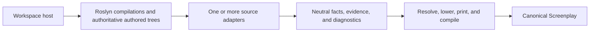

Build a source adapter when you need to recover a framework's authored .NET semantics into a verified Screenplay model.

A source adapter owns **framework interpretation**. It does not load an MSBuild workspace, start the analyzed application, inspect live infrastructure, construct Screenplay syntax, or print `.play` text.



## Choose the packages

| Package | Use it for |
| --- | --- |
| `Cratis.Screenplay.Generation.Contracts` | Framework-neutral facts, identities, evidence, and diagnostics |
| `Cratis.Screenplay.Generation` | Resolution, lowering, canonical printing, and compiler verification |
| `Cratis.Screenplay.Generation.DotNet` | Roslyn analysis, source evidence, type shapes, concepts, and source placement |
| `Cratis.Screenplay.Generation.DotNet.Vogen` | Optional Vogen source adapter composed by a host; ecosystem adapters do not need it unless they own that composition |

Only these four Generation packages release in lockstep. Ecosystem adapters and hosts have independent versions.

| Project role | Typical references |
| --- | --- |
| Adapter library | Contracts + DotNet |
| Composition host | Generation + every explicitly selected adapter |
| Adapter specs | Adapter library + Roslyn CSharp + specification packages |
| Analyzed application | Its own framework packages only; it does not reference Generation |

Keep runtime packages for the framework you analyze out of the adapter whenever Roslyn metadata names can express the contract. This avoids loading one framework version into a host that analyzes another version.

Reference one version across all directly referenced Screenplay Generation packages.

:::note
`v0.16.0` is the current public release and package-validation baseline. Described adapters, atomic admission, deterministic runner snapshots, and final fact dispositions are included in that lockstep package set. Granular type-use derivation is additive on `main`.
:::

| Capability | Released `0.16.0` | Current `main` |
| --- | ---: | ---: |
| Adapter, context, neutral fact, evidence, and diagnostic contracts | Yes | Yes |
| Stable source identity, fixed source snapshots, and strict placement | Yes | Yes |
| Executable specification facts and `DotNetConceptFacts` | Yes | Yes |
| Symbol, invocation, and exact normalized signature helpers | Yes | Yes |
| Bounded scalar, `typeof`, payload, and collection extraction | Yes | Yes |
| Overload-safe subjects, alternate source owners, and flat compatibility placement | Yes | Yes |
| Authoritative invocation and assignment enumeration | Yes | Yes |
| Legacy `IDotNetScreenplayAdapter` | Yes | Yes |
| Descriptors, structured probes, and atomic public admission | Yes | Yes |
| Explicit modern/legacy registration and deterministic .NET runner | Yes | Yes |
| Immutable adapter-run snapshots and `Generate(snapshot)` | Yes | Yes |
| Per-fact generation dispositions | Yes | Yes |
| Vogen modern descriptor/probe with legacy contribution parity | Yes | Yes |
| Granular artifact/member/type-use/binding/role facts | No | Yes |
| Fixed-snapshot derivation rule and input/evidence lineage | No | Yes |
| Exact nested .NET type-use fact emission | No | Yes |

## Implement the adapter contract

The original `IDotNetScreenplayAdapter` remains supported for existing adapters and hosts. New adapters should implement `IDescribedDotNetScreenplayAdapter`. During migration, implement both interfaces over one analysis path: modern hosts receive a descriptor and structured probe, while legacy hosts retain `Identity`, `CanAnalyze()`, and byte-compatible contributions.

A descriptor states what the host is about to trust. Choose the narrow semantic `AdapterCategory` (`ApplicationFramework`, `EventSourcing`, `EventStore`, `Messaging`, `Concepts`, `Validation`, or `Integration`), declare `CSharp` or truly `SourceIndependent` input, bound compatible Generation versions when the adapter has a tested range, list required host services, name exact framework API capabilities that an applicable probe must prove, and list every neutral fact family analysis may emit. `Legacy` is reserved for the compatibility registration synthesized by `ForLegacy(...)`.

```csharp
using Cratis.Screenplay.Generation;
using Cratis.Screenplay.Generation.DotNet;
using Microsoft.CodeAnalysis;

namespace Acme.Screenplay;

public sealed class AcmeScreenplayAdapter :
    IDescribedDotNetScreenplayAdapter,
    IDotNetScreenplayAdapter
{
    static readonly AdapterApiCapability _commandDeclarationApi = new()
    {
        Id = "acme.command-declaration"
    };

    public AdapterDescriptor Descriptor { get; } = new()
    {
        Identity = new AdapterIdentity { Id = "acme", Version = "1.0.0" },
        SourceLanguage = AdapterSourceLanguage.CSharp,
        Category = AdapterCategory.ApplicationFramework,
        RequiredHostCapabilities =
        [
            AdapterHostCapability.AuthoredSource,
            AdapterHostCapability.StableSourceLocations,
            AdapterHostCapability.SemanticAnalysis
        ],
        RequiredApiCapabilities = [_commandDeclarationApi],
        EmittedFactCapabilities =
        [
            GenerationFactCapability.Artifact,
            GenerationFactCapability.ArtifactMemberDeclaration,
            GenerationFactCapability.ArtifactMemberTypeUse
        ]
    };

    // Legacy compatibility surface.
    public AdapterIdentity Identity => Descriptor.Identity;

    // A blocked modern probe maps to false because the legacy Boolean cannot report why analysis is unsafe.
    public bool CanAnalyze(DotNetAnalysisContext context) =>
        Probe(context) is AdapterProbeApplicable;

    public AdapterProbeResult Probe(DotNetAnalysisContext context)
    {
        var declarations = context.Projects
            .SelectMany(project => new DotNetArtifactCatalog(project.Compilation).Types
                .SelectMany(type => DotNetSource.AuthoredAttributesOf(type, project.AuthoredSyntaxTrees)
                    .Where(attribute =>
                        attribute.AttributeClass is not null &&
                        DotNetSubjectIds.MetadataName(attribute.AttributeClass) == "Acme.CommandAttribute")
                    .Select(attribute => (Project: project, Type: type, Attribute: attribute))))
            .ToArray();
        if (declarations.Length == 0)
        {
            return new AdapterProbeNotApplicable();
        }

        return new AdapterProbeApplicable
        {
            Evidence =
            [
                .. declarations.Select(declaration => new AdapterProbeEvidence
                {
                    Description = "An authored type uses the exact Acme command declaration API",
                    ApiCapability = _commandDeclarationApi,
                    Source = DotNetSource.RangeForProject(
                        declaration.Attribute.ApplicationSyntaxReference!.GetSyntax().GetLocation(),
                        declaration.Project),
                    Subject = declaration.Project.SubjectForType(declaration.Type)
                })
            ]
        };
    }

    public AdapterContribution Analyze(
        DotNetAnalysisContext context,
        DotNetAdapterOptions options)
    {
        var facts = new List<GenerationFact>();
        var diagnostics = new List<GenerationDiagnostic>();

        foreach (var project in context.Projects)
        {
            foreach (var type in new DotNetArtifactCatalog(project.Compilation).Types)
            {
                var commandAttribute = DotNetSource
                    .AuthoredAttributesOf(type, project.AuthoredSyntaxTrees)
                    .FirstOrDefault(attribute =>
                        attribute.AttributeClass is not null &&
                        DotNetSubjectIds.MetadataName(attribute.AttributeClass) == "Acme.CommandAttribute");
                if (commandAttribute is null)
                {
                    continue;
                }

                var subject = project.SubjectForType(type);
                var evidence = DotNetSource.EvidenceFor(
                    commandAttribute,
                    Identity,
                    project,
                    EvidenceStrength.Exact,
                    "The authored type has Acme.CommandAttribute");
                var key = new ArtifactKey
                {
                    Subject = subject,
                    Kind = ArtifactKind.Command
                };

                facts.Add(new ArtifactFact
                {
                    Id = new FactId { Value = $"acme:command:{subject.Value}" },
                    Subject = subject,
                    Definition = new ArtifactDefinition
                    {
                        Key = key,
                        Name = type.Name,
                        File = evidence.Source?.Path,
                        Properties = DotNetTypeShapes.PropertiesOf(type)
                    },
                    Evidence = evidence
                });
                facts.AddRange(DotNetTypeUseFacts.Emit(type, key, context, evidence));
            }
        }

        return new AdapterContribution
        {
            Adapter = Identity,
            Facts = facts,
            Diagnostics = diagnostics
        };
    }
}
```

Keep `Probe()` cheap, deterministic, and semantic. Package presence alone must not make a probe applicable. `AdapterProbeEvidence` can identify an exact required `AdapterApiCapability`, source range, and subject. Return `AdapterProbeBlocked` with valid diagnostics when the source applies but analysis cannot proceed safely. The runner admits and freezes probe evidence before it considers analysis.

The compatibility `CanAnalyze()` above delegates to the modern probe without changing `Analyze()`. Existing binaries can continue to call the legacy interface, while a modern host registers the same adapter with `DotNetAdapterRegistration.For(...)`. This first pass emits only the exact command artifact. Add placement through the fixed source snapshot and shared derivation pipeline in [Derive source placement](#derive-source-placement); do not derive it ad hoc inside artifact discovery.

## Establish the analysis context in the host

The workspace host owns project loading and source authority. `Cratis.Screenplay.Generation.DotNet` deliberately does not reference `MSBuildWorkspace`; an MSBuild host additionally references `Microsoft.CodeAnalysis.Workspaces.MSBuild` and `Microsoft.Build.Locator`.

For each project, supply a `DotNetProjectCompilation` with:

- a stable logical `Name`;
- the Roslyn `Compilation`;
- the exact `AuthoredSyntaxTrees` captured from project documents;
- an optional `DotNetProjectSourceContext` for stable source identity and display paths;
- `DotNetProjectRole.Application` or `DotNetProjectRole.Specifications`;
- optional compatibility values such as `ProjectPath` and `SourceRoot`.

A minimal trusted host looks like this:

```csharp
using Cratis.Screenplay.Generation.DotNet;
using Microsoft.Build.Locator;
using Microsoft.CodeAnalysis;
using Microsoft.CodeAnalysis.MSBuild;

MSBuildLocator.RegisterDefaults();
using var workspace = MSBuildWorkspace.Create();
var workspaceFailures = new List<string>();
workspace.WorkspaceFailed += (_, args) => workspaceFailures.Add(args.Diagnostic.Message);
var projectPath = Path.GetFullPath("Source/Application/Application.csproj");
var workspaceRoot = Path.GetFullPath(".");
var loadedProject = await workspace.OpenProjectAsync(projectPath);
var projectDirectory = Path.GetDirectoryName(projectPath)!;
var authoredTrees = new HashSet<SyntaxTree>();
var sourceDocuments = new List<DotNetSourceDocument>();

foreach (var document in loadedProject.Documents.OrderBy(_ => _.FilePath, StringComparer.Ordinal))
{
    if (document.FilePath is null || await document.GetSyntaxTreeAsync() is not { } tree)
    {
        continue;
    }

    authoredTrees.Add(tree);
    sourceDocuments.Add(new DotNetSourceDocument
    {
        SyntaxTree = tree,
        ProjectRelativePath = Path.GetRelativePath(projectDirectory, document.FilePath),
        WorkspaceRelativePath = Path.GetRelativePath(workspaceRoot, document.FilePath)
    });
}

var compilation = await loadedProject.GetCompilationAsync() ??
                  throw new InvalidOperationException("The project did not produce a compilation");
var compilationErrors = compilation.GetDiagnostics()
    .Where(_ => _.Severity == DiagnosticSeverity.Error)
    .ToArray();
if (workspaceFailures.Count > 0 || compilationErrors.Length > 0)
{
    throw new InvalidOperationException(string.Join(
        Environment.NewLine,
        workspaceFailures.Concat(compilationErrors.Select(_ => _.ToString()))));
}

var sourceContext = DotNetSourcePaths.Create(
    "Source/Application/Application",
    new DotNetSourcePathPolicy
    {
        Version = 1,
        DisplayRoot = DotNetSourceDisplayRoot.Workspace,
        CasePolicy = DotNetSourcePathCasePolicy.Ordinal
    },
    sourceDocuments);
var project = new DotNetProjectCompilation
{
    Name = loadedProject.Name,
    Role = DotNetProjectRole.Application,
    ProjectPath = projectPath,
    SourceContext = sourceContext,
    Compilation = compilation,
    AuthoredSyntaxTrees = authoredTrees
};
var context = new DotNetAnalysisContext([project]);
```

Capture authored trees from `Project.Documents`. Generated filenames and headers are useful corroboration, but they are not source authority. Assign `DotNetProjectRole.Specifications` to specification projects instead of inferring that role from their name.

Use `DotNetSourcePaths.Create(...)` to map project documents into a stable source context. Physical checkout roots must not become identities. Prefer `DotNetSource.EvidenceFor(..., project, ...)` and `DotNetSource.RangeForProject(...)` over the legacy `SourceRoot` overloads.

A modern adapter should declare `AdapterHostCapability.StableSourceLocations` when its probe, facts, or diagnostics depend on portable source identity. The runner then requires every project to expose authoritative authored trees and a complete `DotNetProjectSourceContext`; located probe evidence and contribution ranges must map to those exact trees and include their stable `SourceFileIdentity`. Missing host capability blocks before `Probe()`, malformed or nonauthoritative probe evidence blocks after `Probe()`, and nonauthoritative contribution source rejects that contribution atomically. The modern Vogen descriptor requires this capability. Legacy registrations retain path-only source compatibility.

A truly source-neutral adapter can declare `AdapterSourceLanguage.SourceIndependent`, no host capabilities, and no source ranges. It can run with `new DotNetAnalysisContext([])`. Declaring any host capability intentionally restores host and project-roster gating.

## Use shared Roslyn mechanics

Prefer semantic helpers over adapter-specific syntax utilities:

- `DotNetArtifactCatalog` provides canonical source type discovery;
- `DotNetTypeShapes` converts public properties and exact type subjects;
- `DotNetSymbols` handles metadata-name attributes and interfaces, collection elements, named arguments, and companion method families;
- `DotNetInvocations` resolves exact direct and reduced methods, formal-parameter arguments, and bounded receiver roots;
- `DotNetMethodSignatures` captures and matches exact normalized containing type, nullability, method/static/extension/generic/return/ref, and ordered parameter/ref/`params`/receiver shape;
- `DotNetSourceValues` returns `DotNetKnown<T>` only for exact bounded constants, types, payloads, and collections and `DotNetUnknown<T>` with deterministic failures otherwise;
- `DotNetSource` establishes authored declarations, attributes, evidence, and ranges.

`DotNetInvocations.MethodFor(...)` returns `null` when Roslyn has no exact symbol. Do not use candidate symbols to guess through a broken compilation. Use `DefinitionOf(...)` before matching generic extension metadata, `ArgumentForParameter(...)` with the owning semantic model instead of positional assumptions, and `ReceiverRootParameter(...)` only for a bounded direct parameter-root check. Omitted optional parameters, expanded `params` arguments, aliases, invocation results, and unqualified instance receivers resolve to `null` rather than a partial guess.

Create a `DotNetMethodSignature` from the exact allowlisted method symbol available to the analyzed compilation, then match bound candidates with `DotNetMethodSignatures.Matches(...)`. The descriptor retains nullability and symbol identity, so it is intentionally compilation-bound; do not reconstruct expected signatures from display strings, aliases, short names, or symbols from an unrelated compilation.

Use `DotNetSourceValues.Extract(...)` or the typed `Constant<T>(...)` / `TypeOf(...)` / `Payload(...)` / `Collection(...)` helpers instead of reading `ConstantValue` or walking initializer syntax directly. Pattern-match `DotNetKnown<T>` and publish dependent facts only from its value; a `DotNetUnknown<T>` exposes every deterministic child failure and no partial value. Typed constants are limited to an exact primitive, string, or null runtime type. Source enum constants stay as exact `IFieldSymbol` values through untyped extraction so aliases are preserved; they are never exposed as underlying numbers by `Constant<T>`.

Payloads order constructor values by formal parameter and initializer values by authored order. Every payload constructor parameter must be supplied explicitly; expanded `params`, omitted optional values, indirect/index initializers, duplicate members, or one unknown nested child make the complete payload unknown. Collections preserve each element's exact location and support explicit or implicit arrays whose constructed outer rank is one, including recursively exact jagged arrays, plus collection expressions and direct collection initializers whose `Add` operation has exactly one authored argument. Compiler-supplied optional or `params` constructor and `Add` arguments are runtime effects, not authored collection elements, and remain allowed when the initializer entry authors exactly one `Add` argument. Computed or mismatched dimensions, invalid type or conversion binding, multi-argument `Add` entries, opaque spreads, and any unknown nested element fail the whole collection atomically. A payload or collection shape failure does not stop inspection of explicit authored arguments, right-hand sides, or elements: every deterministic child failure is reported without publishing partial values.

Adapter discovery depends on compiler symbols and semantic models, not preferred source formatting. Keep one reusable source fixture with semantically valid generated, decompiler-style, fully qualified, explicitly cast, and otherwise non-idiomatic C#. Its supported facts must resolve without extra loss.

## Use stable identities

Three identities serve different purposes:

- `AdapterIdentity` identifies the adapter implementation and version.
- `SubjectId` identifies the source entity that facts describe.
- `FactId` identifies one semantic assertion.

Use project-qualified identities:

```csharp
var typeSubject = project.SubjectForType(type);
var methodSubject = project.SubjectForMethod(method);
```

`SubjectForMethod()` uses a .NET documentation identity so overloads, generic arity, arrays, and parameter modifiers do not collide. Use `DotNetSubjectIds.MethodDisplayName(method)` for readable diagnostics; never use a short method name as identity.

Fact IDs must be globally stable and unique. Prefix them with the adapter and semantic role, and add a discriminator when one source member can produce several same-kind assertions.

## Contribute neutral facts

Use the smallest fact vocabulary that says what the source proves:

- `ArtifactFact` — the compatibility aggregate for a command, event, read model, projection, reaction, message, handler, concept, or another supported role;
- `ArtifactDeclarationFact` and `ArtifactMemberDeclarationFact` — independent artifact metadata and one ordered member declaration without repeating a complete property list;
- `ArtifactMemberTypeUseFact` — one exact use-site type shape and observed source subject;
- `TypeUseBindingFact` — an exact member-to-artifact binding, normally produced by fixed-snapshot derivation;
- `ArtifactMemberRoleFact` — an explicitly established typed identifier or event-source-identifier role;
- `ArtifactPlacementFact` — module, feature, slice, and independently established slice kind;
- `RelationshipFact` — handles, reads, produces, consumes, builds, returns, cascades, publishes, starts or appends streams, or document persistence;
- concept representation, attribute, and validation facts;
- specification scenario, step, and typed value facts.

Do not overload a nearby role. A published message is not a persisted event. A document is not an event-built read model unless source evidence proves the projection. A response is not a cascade.

Keep compatibility aggregate properties unbound with `DotNetTypeShapes.PropertiesOf(type)` when another adapter may declare their target concepts. Append `DotNetTypeUseFacts.Emit(type, artifact, context, evidence)` so each member independently records declaration order, exact use-site shape, and the terminal project-qualified source subject. Fixed-snapshot derivation then emits a granular binding without rewriting the aggregate.

`DotNetTypeShapes.TypeUseFor(type, context)` orders shape nodes from the outermost wrapper to the terminal `Named` node. This distinguishes `Collection(Optional(Named))` from `Optional(Collection(Named))` and preserves nested collections. The current Screenplay grammar lowers only the shapes it can express exactly; unsupported distinctions remain diagnosed rather than flattened.

Pass a `roleFor` callback to `DotNetTypeUseFacts.Emit(...)` only when source-framework semantics establish `ArtifactMemberRoleKind.Identifier` or `EventSourceIdentifier`. Never infer either role from a property name or primitive type. A framework that already knows the exact target inside one adapter may continue setting `TypeReferenceDefinition.Subject` directly with `PropertiesOf(type, context)` or `TypeReferenceFor(type, context)`.

## Nominate declared concepts

When a framework explicitly declares a wrapper as a domain value through an authored attribute or registration API, use:

```csharp
var facts = DotNetConceptFacts.Emit(
    wrapper,
    backing,
    project.SubjectForType(wrapper),
    conceptEvidence,
    representationEvidence);
```

Do not infer concepts from names such as `Id`, from having one property, or from an arbitrary record-struct shape. If the framework nominates the concept but does not prove its primitive backing, retain the concept artifact and emit an adapter-owned `Unsupported` diagnostic instead of inventing a representation.

## Derive source placement

Source layout does not decide semantic role. First establish `ArtifactKind` and `GenerationSliceKind` from framework semantics. Then use the shared placement pipeline:

1. Create a fixed snapshot with `DotNetSourceStructures.Create(context)`.
2. Find the source structure for the artifact subject, or for an exact different source owner established by adapter semantics.
3. Build a `DotNetSourcePlacementRequest` with the artifact key, unchanged structure, slice kind, and `options.SourceStructurePolicy`. Set `SourceOwner` only when the artifact is method-backed or synthetic and its exact owner is known.
4. Optionally supply an exact, versioned `DotNetSourcePlacementCompatibilityPolicy` for a legacy placement that may be used only after strict `DOTNETSP0004` insufficient-structure failure.
5. Call `DotNetSourcePlacementDerivation.Derive(...)` once for the complete request set.
6. Convert successful placements to `ArtifactPlacementFact` values, retain every placement diagnostic, and pass the result policy and compatibility fields to host provenance.

```csharp
var structureSnapshot = DotNetSourceStructures.Create(context);
diagnostics.AddRange(structureSnapshot.Diagnostics);
var structures = structureSnapshot.Structures.ToDictionary(_ => _.Subject);
var placementRequests = new List<DotNetSourcePlacementRequest>();
foreach (var artifact in facts.OfType<ArtifactFact>())
{
    if (!structures.TryGetValue(artifact.Subject, out var structure))
    {
        diagnostics.Add(new GenerationDiagnostic
        {
            Code = "ACME0001",
            Severity = GenerationDiagnosticSeverity.Error,
            Outcome = GenerationDiagnosticOutcome.Unknown,
            Message = $"Authored source structure for '{artifact.Definition.Name}' is unavailable",
            Source = artifact.Evidence.Source,
            Subject = artifact.Subject
        });
        continue;
    }

    placementRequests.Add(new DotNetSourcePlacementRequest
    {
        Artifact = artifact.Definition.Key,
        Structure = structure,
        SliceKind = GenerationSliceKind.StateChange,
        Policy = options.SourceStructurePolicy
    });
}

var placementSnapshot = DotNetSourcePlacementDerivation.Derive(placementRequests);
diagnostics.AddRange(placementSnapshot.Diagnostics);
foreach (var placement in placementSnapshot.Placements)
{
    var artifact = facts.OfType<ArtifactFact>().Single(_ =>
        _.Definition.Key == placement.Artifact);
    facts.Add(new ArtifactPlacementFact
    {
        Id = new FactId { Value = $"acme:placement:{placement.Artifact.Kind}:{placement.Artifact.Subject.Value}" },
        Subject = placement.Artifact.Subject,
        Artifact = placement.Artifact,
        Placement = placement.Placement,
        Evidence = artifact.Evidence with
        {
            Strength = EvidenceStrength.Heuristic,
            Explanation = "Host-owned source structure provides the default Screenplay placement"
        }
    });
}
```

An adapter with several behavior kinds supplies the independently proven `GenerationSliceKind` for each artifact instead of assigning `StateChange` universally. Snapshot diagnostics and derivation diagnostics both belong in the adapter contribution.

For a query represented by a method subject or a reducer represented by a synthetic subject, do not change `DotNetSourceStructure.Subject`. Set `SourceOwner` to the exact containing type, projection, or model subject. The request remains invalid with `DOTNETSP0012` when the nominated owner differs from the fixed structure, and two different owner requests for one artifact conflict with `DOTNETSP0013`.

Strict placement is the default. A compatibility policy contains the exact legacy `ArtifactPlacement`; Generation does not infer it from a filename. A valid policy can supply placement only when strict resolution returns exactly one `DOTNETSP0004` diagnostic; strict success still wins, while malformed compatibility reports `DOTNETSP0015`. Every other `DOTNETSP####` result remains blocking, including snapshot diagnostics `DOTNETSP0009` through `DOTNETSP0011`, which occur before any placement request exists. `DotNetSourcePlacement.UsedCompatibilityPlacement`, `CompatibilityReasonCode`, `Policy`, `CompatibilityPolicy`, and `SourceOwner` provide defensive, deterministic host/CLI provenance.

The host owns `FeatureRoot`, explicit module, and skipped namespace segments. Folder and namespace evidence must agree when both establish placement.

## Assign evidence strength deliberately

| Strength | Meaning |
| --- | --- |
| `Exact` | A bound invocation, attribute, interface, override, or return type directly proves the fact |
| `Configured` | Authored framework configuration proves the fact |
| `Conventional` | A documented framework convention applies after exact admission |
| `Heuristic` | Naming or structure suggests display or placement only |

A heuristic must never establish persisted events, stream ownership, authorization, or another correctness-critical role.

## Report loss instead of guessing

Each adapter owns a stable diagnostic-code range. Include these values in each diagnostic:

- a stable code;
- severity;
- an `Unknown`, `Conflict`, or `Unsupported` outcome when applicable;
- a precise message;
- a source range when authored source establishes the loss;
- the affected subject.

Use `Unknown` when source cannot establish the answer, `Conflict` when exact assertions disagree, and `Unsupported` when the behavior is known but cannot be represented. Never reuse a published code for a different condition.

When an authored framework extension can alter discovery or runtime conventions beyond what the adapter can prove statically, use a stable adapter-owned code and `GenerationDiagnosticOutcome.Unsupported`. Set `Subject` to the authored extension type. Name both the exact hook surface and affected convention scope:

```text
Authored extension '<type>' uses '<hook surface>' and may alter <scope>; the recovered model reflects default <scope> only.
```

This reports bounded default recovery without treating the entire framework as unrecognized. Do not interpret arbitrary policy bodies.

A host must always display every diagnostic, even when `IsSuccess` is `true`. Errors block publication. Hosts choose whether warnings block adoption, but they must not hide them. Information diagnostics describe known bounded loss.

Tests must assert required artifacts and relationships directly from `Graph` or `Source`; `IsSuccess` alone proves only that no error diagnostic was produced.

## Compose and verify once

The host supplies an explicit registration roster. There is no package scanning or implicit adapter discovery:

```csharp
var roster = new DotNetAdapterRegistration[]
{
    DotNetAdapterRegistration.For(new AcmeScreenplayAdapter()),
    DotNetAdapterRegistration.For(new VogenConceptScreenplayAdapter()),
    DotNetAdapterRegistration.ForLegacy(unchangedLegacyAdapter)
};

var snapshot = DotNetAdapterRunner.Run(roster, context, options);
var result = new ScreenplayDefinitionGenerator().Generate(
    snapshot,
    new ScreenplayGenerationOptions { Domain = "Ordering" });
```

`DotNetAdapterRunner` canonicalizes the roster and project input, considers every registration once, probes each eligible adapter once, and analyzes each applicable adapter once. `NotApplicable` and `Blocked` adapters never execute. Contributions remain separate and are admitted atomically before the runner returns a deeply frozen `AdapterRunSnapshot`; mutating adapter-owned lists or records after `Run()` cannot change it.

The boundary fails closed at a precise stage:

| Failure | Result |
| --- | --- |
| Duplicate adapter ID | Every duplicate registration is `RosterRejected` before probe or analysis |
| Invalid descriptor | Registration is `RosterRejected` with deterministic descriptor-admission diagnostics |
| Incompatible Generation version | `Blocked` before probe against the host's loaded `Generation.Contracts` version |
| Unsupported language or missing host capability | `Blocked` before probe |
| Ambiguous or duplicate project identity | Source-dependent adapters are `Blocked` before probe; a host-free source-independent adapter may continue |
| Malformed or nonauthoritative probe evidence, or missing required API evidence | `Blocked` after one probe; analysis does not run |
| Probe-declared known limitation | `AdapterProbeBlocked` preserves canonical diagnostics; analysis does not run |
| Malformed, unscoped, undeclared, identity-mismatched, or nonauthoritative contribution | The complete contribution is `ContributionRejected`; no partial facts enter the snapshot |
| Probe or analysis callback throws | `ExecutionFailed` with a stable boundary diagnostic; exception details and machine paths are not exposed |

`AdapterRunSnapshot.Adapters` preserves each descriptor, structured probe, execution result, and disposition. Its admitted facts initially have `GenerationFactDisposition.Unknown`. `Generate(snapshot, options)` returns a new canonical snapshot in `GeneratedScreenplayDefinition.AdapterRun` with every admitted fact classified:

| Disposition | Meaning |
| --- | --- |
| `Lowered` | The fact contributed directly to emitted Screenplay syntax |
| `ProvenanceOnly` | The assertion was retained as supporting provenance but did not add syntax |
| `OmittedWithDiagnostic` | Generation omitted the fact and attached the diagnostic that explains why |
| `Conflicted` | The fact participated in an unresolved competing definition |

The snapshot overload preserves runner, contribution, resolution, lowering, and verification diagnostics. For the same admitted contributions it produces the same canonical bytes as the original `Generate(IEnumerable<AdapterContribution>, ...)` overload. The original overload and `IDotNetScreenplayAdapter` remain supported; use them only when a host does not need the execution record.

`VogenConceptScreenplayAdapter` implements both interfaces. Prefer the modern registration when the host supplies stable mappings:

```csharp
var modern = DotNetAdapterRunner.Run(
    [DotNetAdapterRegistration.For(new VogenConceptScreenplayAdapter())],
    stableContext,
    options);

var legacy = DotNetAdapterRunner.Run(
    [DotNetAdapterRegistration.ForLegacy(new VogenConceptScreenplayAdapter())],
    legacyCompatibleContext,
    options);
```

The modern descriptor has category `Concepts`, source language `CSharp`, requires authored source, stable source locations, semantic analysis, and exact Vogen declaration API evidence, and declares its concept fact families. Its probe distinguishes no declarations, safely applicable declarations, and unsafe mappings. Run the modern and legacy registrations separately: both use the `vogen` identity, so placing both in one roster is a deliberate duplicate rejection. When each path is safely applicable, their contribution facts and diagnostics are identical.

### Derive facts from one fixed admitted snapshot

`GenerationFactDerivation.Derive(...)` runs the closed built-in rule set once over `AdapterRunSnapshot.Facts`. Every rule sees the same deeply frozen base array. A rule never consumes another rule's output, inspects adapter registrations or instances, or reopens source-language state.

The type-use binding rule joins an `ArtifactMemberTypeUseFact` to an exact declared artifact subject. It does not join by display name and does not replace the owning artifact's complete property list. Its derived `TypeUseBindingFact` remains separate from the admitted base facts under `AdapterRunSnapshot.Derivation`.

Each derived `GenerationFactRecord` carries `GenerationFactLineage`: the stable derivation rule identity and version, canonical input `FactId` references, and complete input evidence. `GenerationDerivationRuleRecord` records the fixed inputs, outputs, and diagnostics for that rule execution. Directly invoking derivation leaves fact dispositions unknown because disposition is a later generation decision. `Generate(snapshot, options)` attaches the derivation result, propagates its diagnostics, resolves admitted and derived granular facets together, and applies an exact member binding as an overlay without publishing a replacement aggregate fact.

Exact subjects can come from any source frontend. A C# member type use can bind a declaration contributed by another adapter, while a source-independent or non-.NET adapter can contribute the same neutral contracts without Roslyn or Screenplay-layout dependencies. Missing, ambiguous, or conflicting inputs produce stable diagnostics without selecting a winner.

The execution and derivation snapshots are not a history model. They have no issue #24 serializer or stable fingerprints; keep them in process and compare canonical generated bytes when determinism matters.

Adapters never call the runner, resolver, lowerer, printer, or compiler themselves. Adopt a newly required API in this order:

1. release Screenplay Generation;
2. upgrade and release the ecosystem adapter;
3. upgrade the composition host.

## Test the adapter

Every adapter should prove:

1. exact positive discovery;
2. close lookalikes do not match;
3. generated-only declarations cannot originate facts;
4. unknown or ambiguous source fails closed;
5. overload and same-name identities remain distinct;
6. reversed project, adapter, fact, and syntax-tree order is byte-identical;
7. relocated checkouts preserve stable identities;
8. non-idiomatic but semantically equivalent source yields equivalent facts;
9. incompatible assertions remain visible conflicts;
10. diagnostic codes, outcomes, subjects, and locations are stable;
11. generated Screenplay compiles and survives print, compile, and print unchanged;
12. package consumers compile against the candidate package set.

Use public, pinned framework samples for package-level compatibility. Keep focused authored-source fixtures purpose-built and independent of private product source.

Start with one positive `Specification` that creates a `CSharpCompilation`, establishes its authored trees, invokes the adapter, resolves the contribution, and asserts the exact artifact, placement, evidence, and diagnostics. Add a second source tree with the same short names in an unrelated namespace and prove it contributes nothing.

Use these implementations as examples only:

- [Vogen concept adapter](https://github.com/Cratis/Screenplay.Generation/blob/main/Source/DotNET/Generation.DotNet.Vogen/VogenConceptScreenplayAdapter.cs)
- [Arc source adapter](https://github.com/Cratis/Arc)
- [Critter Stack source adapter](https://github.com/Cratis/Screenplay.CritterStack)

## Release and adopt the adapter

Before publishing an adapter or a new Generation minor, run:

```bash
dotnet test Screenplay.Generation.slnx --configuration Debug
dotnet build Screenplay.Generation.slnx --configuration Release -p:Version=9999.0.0
dotnet pack Screenplay.Generation.slnx --no-build --configuration Release \
  -o Artifacts/NuGet -p:Version=9999.0.0
./scripts/verify-package-consumers.sh 9999.0.0 Artifacts/NuGet
```

Use the ecosystem adapter's equivalent sentinel package and consumer gate. Apply the same sentinel version to the build and no-build pack so package and assembly versions agree. Run API package validation and a clean current-source consumer. Upgrade composition hosts and ecosystem adapters together when they need a newly released Generation API.
