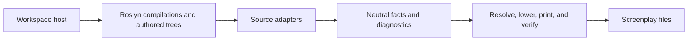

Screenplay Generation is the framework-neutral SDK for recovering authored source semantics into verified [Cratis Screenplay](https://github.com/Cratis/Screenplay) definitions.

Source adapters contribute typed facts, evidence, provenance, and diagnostics. Screenplay Generation resolves those contributions together, lowers the result, prints canonical Screenplay, and verifies it with the Screenplay compiler.

## Build a source adapter

Use the [source adapter guide](guides/build-source-adapter.md) to implement a .NET adapter, establish source authority in its host, report bounded semantic loss, compose contributions, and verify deterministic output.

The guide is the canonical onboarding contract for source-adapter authors. Ecosystem adapters remain independently versioned and owned by the frameworks they analyze.

## Packages

| Package | Responsibility |
| --- | --- |
| `Cratis.Screenplay.Generation.Contracts` | Framework-neutral facts, identities, evidence, provenance, and diagnostics |
| `Cratis.Screenplay.Generation` | Deterministic resolution, Screenplay lowering, canonical printing, and compiler verification |
| `Cratis.Screenplay.Generation.DotNet` | Reusable Roslyn compilation, authored-source, symbol, type-shape, concept, and placement APIs |
| `Cratis.Screenplay.Generation.DotNet.Vogen` | Optional Vogen concept adapter for host composition |

The four packages release in lockstep. Ecosystem adapters and workspace hosts use independent versions.
